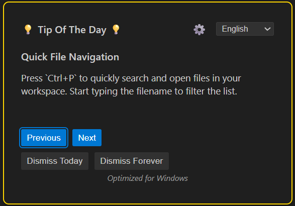

# VS Code Tip of the Day

Enhance your VS Code productivity with daily tips! This extension delivers curated tips about VS Code features, shortcuts, and best practices directly to you through VS Code's notification system, with OS-specific optimizations and easy settings access.

## Features

- 🎯 Daily VS Code tips to improve your coding workflow
- 🖥️ **OS-specific tip optimization** (Windows, macOS, Linux) with automatic detection
- ⭐ **Favorites/Bookmark Feature** - Save your favorite tips for quick reference
- ⚙️ **Quick settings access** via settings icon in tip panel
- ⌨️ Keyboard shortcut (`Ctrl+Alt+T` / `Cmd+Alt+T`) to show tips on demand
- 🎲 **Smart random tip selection** with history tracking to avoid repetition
- 📚 Navigate through tips (Previous/Next buttons)
- ♿ **Full keyboard accessibility** with proper focus management and ARIA labels
- 👥 **Community contributions** with contributor attribution and easy tip submission
- ⏰ Configurable startup time for daily tips
- 🔧 Flexible notification system that doesn't interrupt your workflow
- 🌐 **Complete multi-language support** with all tips translated across 11 languages
- 🔄 **Language switching** via dropdown in the tip panel with full parity

## Supported Languages

This extension supports the following languages:

- 🇺🇸 English
- 🇨🇳 Chinese (Mandarin) - 中文
- 🇮🇳 Hindi - हिन्दी
- 🇪🇸 Spanish - Español
- 🇫🇷 French - Français
- 🇸🇦 Arabic - العربية
- 🇧🇩 Bengali - বাংলা
- 🇧🇷 Portuguese - Português
- 🇷🇺 Russian - Русский
- 🇯🇵 Japanese - 日本語
- 🇮🇱 Hebrew - עברית

Switch languages using the dropdown in the tip panel, and your preference will be saved for future sessions.

## How to Use

1. **Daily Tips**: By default, you'll receive a tip notification when VS Code starts (after your configured hour)
2. **On-Demand Tips**: Press `Ctrl+Alt+T` (`Cmd+Alt+T` on macOS) to see the current tip
3. **Bookmark Tips**: Click the star icon (⭐) to save your favorite tips
4. **View Favorites**: Access your bookmarked tips via `Ctrl+Shift+P` > `TOTD: View Favorites`
5. **Settings Access**: Click the settings icon (⚙️) in the tip panel to quickly access extension settings
6. **OS Optimization**: Tips are automatically optimized for your operating system, or you can manually select your preferred OS in settings
7. **Navigation**:
   - Use the "Show Next Tip" command to see the next tip
   - Use the "Show Previous Tip" to review earlier tips
   - Try "Show Random Tip" to discover something new

## Commands

- `Show Tip of the Day`: Display the current daily tip
- `Show Next Tip`: Navigate to the next tip
- `Show Previous Tip`: Go back to the previous tip
- `Show Random Tip`: Display a random tip
- `TOTD: View Favorites`: View your bookmarked favorite tips
- `Dismiss Tip for Today`: Skip today's tip
- `Disable Tips`: Turn off tips permanently

## Extension Settings

This extension contributes the following settings:

- `tipOfTheDay.enabled`: Enable or disable Tip of the Day
- `tipOfTheDay.showOnStartup`: Show tip when VS Code starts (default: true)
- `tipOfTheDay.startupHourLocal`: Only show tips after this hour (24-hour format, local time)
- `tipOfTheDay.language`: Language for tips and interface (default: "en", supports 11 languages)
- `tipOfTheDay.operatingSystem`: Operating system for tip optimization - choose "auto" for automatic detection, or manually select "Windows", "macOS", or "Linux" (default: auto)

## Release Notes

### 1.4.0

- 🎲 **Smart random tip selection** with history tracking to avoid showing the same tip repeatedly
- ♿ **Full keyboard accessibility** - navigate the entire UI using keyboard alone with proper focus management
- 🔄 **Enhanced tip rotation** - new day always shows a new random tip

### 1.2.2

- 🌍 Support partial localization for:
  - Arabic (`ar`)
  - Bengali (`bn`)
  - English (`en`)
  - Spanish (`es`)
  - French (`fr`)
  - Hebrew (`he`)
  - Hindi (`hi`)
  - Japanese (`ja`)
  - Portuguese (`pt`)
  - Russian (`ru`)
  - Chinese (Mandarin) (`zh`)

### 1.2.0

- ⚙️ **Added settings icon to tip panel** - Quick access to extension settings
- 🖥️ **OS-specific tip optimization** - Tips are now optimized for Windows, macOS, and Linux
- 🔄 **Automatic OS detection** - Extension auto-detects your OS and saves it to settings
- 📱 **Manual OS selection** - Override auto-detection by manually selecting your preferred OS
- 🎨 **Improved UI** - Enhanced tip panel with header layout and better styling

### 1.1.0

- Enhanced tip management and navigation
- Improved error handling and user experience
- Better startup configuration options

### 1.0.0

- Initial release
- Daily VS Code productivity tips
- Configurable notification system
- Navigation commands for tips
- Keyboard shortcut support
- Customizable startup settings
